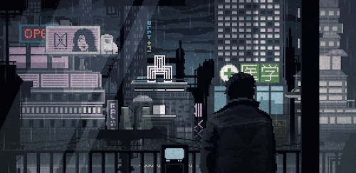

# Hey, I'm Matheus Amaral 👋

### Full Stack Developer · Computer Engineer · Student

 

<table align="center">
<tr>
<td valign="top" width="75%">

### 🧭 About Me

- 🎓 Technology in Internet Systems (TSI) — **IFES**
- 📚 Computer Engineering — **FAESA Centro Universitário**
- 💼 3+ years building full stack web applications
- 🛠️ Comfortable across Java/Spring, Angular, and PHP/Laravel stacks

</td>
<td valign="top" width="25%">

### 📫 Social Media

 
 
 

</td>
</tr>
</table>

 

## 🧰 Tech Stack

### **Languages**

 

### **Frameworks & Tools**

 

### **Databases**

 

### **Testing & Libraries**

 

## 🚀 Featured Projects

<table align="center" width="100%">
<tr>
<td width="50%" valign="top">

**[Gerador de Questões Medicina ENADE](https://github.com/MatheusADC/GeradorQuestoesMedicinaENADE)**
JavaScript · Question generator for ENADE medicine exams

**[Combate às Chamas](https://github.com/MatheusADC/Projeto-de-Combate-a-Chamas)**
Python · Fire detection/response project

**[Alexa Skill — Manutenção](https://github.com/MatheusADC/manutencaoAlexa)**
JavaScript · Custom Alexa maintenance skill

**[Carrinho Controller](https://github.com/MatheusADC/CarrinhoController)**
React Native · Mobile shopping cart controller

**[Gerenciador de Livraria](https://github.com/MatheusADC/Bookstore)**
C# · Bookstore management system

</td>
<td width="50%" valign="top">

**[ImHere App](https://github.com/MatheusADC/im-here)**
React Native · Attendance tracking app

**[Cardápio Digital](https://github.com/MatheusADC/CardapioDigitalReact)**
React · Digital restaurant menu

**[Balança Digital](https://github.com/MatheusADC/Balanca-Digital)**
C++ · Digital scale firmware/logic

**[Minidrone](https://github.com/MatheusADC/Minidrone)**
C++ · Mini drone control system

**[Robgol](https://github.com/MatheusADC/RobGol)**
C++ · Robotics/goal-scoring project

</td>
</tr>
</table>

##

  

 

*Thanks for stopping by — feel free to reach out!*

